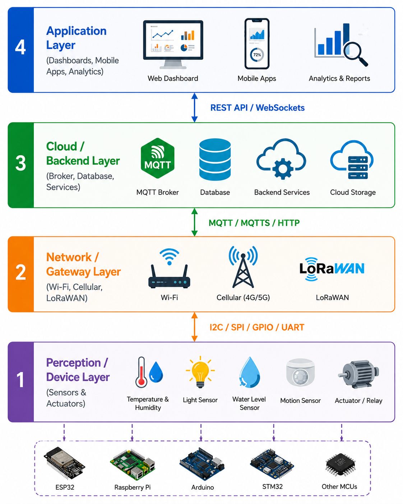

<div align="center">

# 📡 IoT Platform Lab

### A Personal Engineering Laboratory for Internet of Things, Cloud Connectivity and Cyber-Physical Systems

[](LICENSE)


**IoT • MQTT • Cloud • Edge Computing • Dashboards • Industrial Communication**

</div>

---

# 📖 Overview

Welcome to my Internet of Things Laboratory.

This repository documents my journey in designing connected systems, cloud architectures and industrial IoT platforms.

The objective is to understand how embedded devices communicate securely with cloud infrastructures while ensuring scalability, reliability and maintainability.

<div align="center">



</div>

---

# 🎯 Objectives

- Learn IoT architectures
- Master MQTT communication
- Build cloud-connected systems
- Design scalable backends
- Develop monitoring dashboards
- Secure connected devices
- Explore Industrial IoT

---

# 📁 Repository Structure

```text
iot-platform-lab/
│
├── README.md
├── LICENSE
├── ROADMAP.md
├── PROGRESS.md
│
├── docs/
│   ├── iot-fundamentals.md
│   ├── communication-protocols.md
│   ├── cloud-architecture.md
│   ├── security.md
│   ├── deployment.md
│   └── resources.md
│
├── mqtt/
│   ├── basics/
│   ├── qos/
│   ├── retained-messages/
│   ├── last-will/
│   ├── tls/
│   └── projects/
│
├── http/
│
├── websocket/
│
├── esp32/
│
├── backend/
│   ├── nodejs/
│   ├── python/
│   └── php/
│
├── databases/
│   ├── firebase/
│   ├── postgresql/
│   └── influxdb/
│
├── dashboard/
│
├── edge-computing/
│
├── security/
│
├── projects/
│
├── media/
│
└── tools/
```

---

# 📡 Learning Areas

## IoT Fundamentals

- Device Architecture
- Sensors
- Connectivity
- Gateways

---

## Communication

- MQTT
- HTTP
- WebSocket
- CoAP (future)

---

## Cloud

- Firebase
- PostgreSQL
- InfluxDB
- REST APIs

---

## Backend

- Node.js
- Express
- Python APIs
- PHP APIs

---

## Dashboard

- Web Applications
- Real-Time Monitoring
- Data Visualization

---

## Security

- TLS
- Authentication
- Authorization
- Secure MQTT
- Device Identity

---

# 🚀 Projects

Examples include:

- ESP32 → MQTT → Dashboard
- Smart Agriculture
- Smart Home
- Industrial Monitoring
- Remote Data Acquisition

---

# 🌍 Long-Term Vision

Build reliable IoT platforms capable of supporting smart agriculture, Industry 4.0 and intelligent infrastructure across Africa.

---

# 👨‍💻 Author

**Dodji Virgile TCHIDEHOU**

Embedded Systems • IoT • Robotics • Intelligent Systems

---

# 📄 License

MIT License
