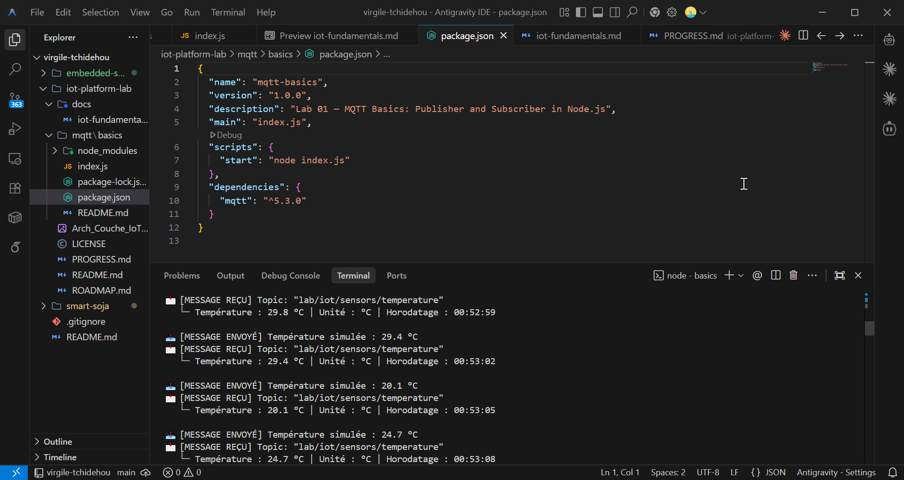

# 01 — MQTT Basics : Publisher & Subscriber

Premier atelier pratique sur le protocole **MQTT** (Message Queuing Telemetry Transport) en utilisant Node.js et un broker public.

---

## 🎯 Quel est l'objectif ?

- Comprendre le modèle **Publish / Subscribe** (Publication / Abonnement)
- Distinguer les rôles d'un **Broker**, d'un **Publisher** et d'un **Subscriber**
- Formater des charges utiles (**Payloads**) au format JSON
- Utiliser la bibliothèque `mqtt` en JavaScript / Node.js

---

## 💡 Pourquoi MQTT est-il le protocole roi de l'IoT ?

Dans les systèmes traditionnels du Web, un client fait des requêtes HTTP directes à un serveur. Mais pour des milliers d'objets connectés (capteurs, automates, téléphones) :
- Les capteurs n'ont pas toujours d'adresse IP fixe
- L'émission HTTP constante consomme trop de batterie et de bande passante
- Les connexions réseau peuvent être instables

**MQTT** résout cela grâce à un **Broker central** :
1. Les capteurs (**Publishers**) envoient des messages légers sur un **Topic** (ex: `lab/iot/sensors/temperature`).
2. Les serveurs ou dashboards (**Subscribers**) s'abonnent à ce **Topic**.
3. Le Broker reçoit et distribue instantanément les messages à tous les abonnés sans que le capteur et le serveur n'aient besoin de se connaître directement !

---

## ⚙️ Architecture de l'atelier

```text
 ┌─────────────────────┐                                ┌─────────────────────┐
 │  Publication (Pub)  │                                │  Abonnement (Sub)   │
 │  toutes les 3s      ├──────┐                  ┌─────►│  Lecture console    │
 └─────────────────────┘      │                  │      └─────────────────────┘
                              ▼                  │
                     ┌───────────────────────────┴┐
                     │    Broker MQTT Public      │
                     │  (test.mosquitto.org:1883) │
                     └────────────────────────────┘
```

---

## 🔁 Comment exécuter cet atelier ?

1. Installez les dépendances :
   ```bash
   npm install
   ```

2. Lancez le script :
   ```bash
   npm start
   ```

---

## 📊 Comportement attendu dans la console

```text
=== 📡 Lab 01 — MQTT Basics ===
Connexion au Broker MQTT : mqtt://test.mosquitto.org...
✅ Connecté au Broker MQTT avec succès !

📥 Abonné avec succès au Topic : "lab/iot/sensors/temperature"
Envoi des mesures simulées toutes les 3 secondes...

📤 [MESSAGE ENVOYÉ] Température simulée : 24.5 °C
📩 [MESSAGE REÇU] Topic: "lab/iot/sensors/temperature"
   └─ Température : 24.5 °C | Unité : °C | Horodatage : 23:40:15

📤 [MESSAGE ENVOYÉ] Température simulée : 26.2 °C
📩 [MESSAGE REÇU] Topic: "lab/iot/sensors/temperature"
   └─ Température : 26.2 °C | Unité : °C | Horodatage : 23:40:18
```

<div align="center">



*Figure 1 : Capture d'écran de l'exécution du client MQTT Node.js (Publish & Subscribe).*

</div>
