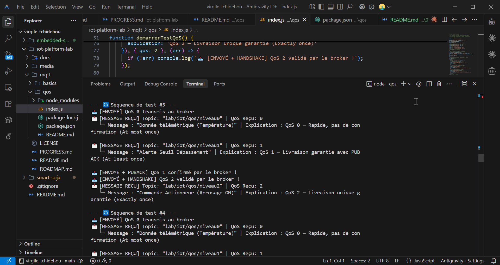

# 02 — MQTT Quality of Service (QoS 0, 1, 2)

Deuxième atelier pratique sur le protocole **MQTT** axé sur la compréhension des 3 niveaux de **Qualité de Service (QoS)** et leurs garanties de livraison.

---

## 🎯 Quel est l'objectif ?

- Comprendre le fonctionnement des 3 niveaux de QoS MQTT (**QoS 0**, **QoS 1**, **QoS 2**)
- Choisir le bon niveau de QoS selon la criticité des données (Télémétrie vs Alarmes vs Commandes)
- Identifier les échanges de paquets réseau sous-jacents (`PUBLISH`, `PUBACK`, `PUBREC`, `PUBREL`, `PUBCOMP`)

---

## 💡 Pourquoi les niveaux de QoS sont-ils essentiels ?

Dans un réseau IoT sans fil (Wi-Fi, 4G, LoRa), les paquets de données peuvent être perdus ou dupliqués en raison des micro-coupures réseau. MQTT propose 3 modes de livraison adaptés à chaque besoin :

```text
 ┌────────────────────────────────────────────────────────────────────────┐
 │                              Niveaux de QoS                            │
 ├───────────────────┬────────────────────────────┬───────────────────────┤
 │ QoS 0             │ QoS 1                      │ QoS 2                 │
 │ (At most once)    │ (At least once)            │ (Exactly once)        │
 ├───────────────────┼────────────────────────────┼───────────────────────┤
 │ 🟢 Le plus rapide │ 🟡 Garantit la réception   │ 🔴 Zéro doublon       │
 │ 🔴 Perte possible │ 🔴 Doublons possibles      │ 🟡 Plus lent (4 msgs) │
 └───────────────────┴────────────────────────────┴───────────────────────┘
```

---

## ⚙️ Les 3 niveaux expliqués avec exemples concrets

### 1. QoS 0 — "Au plus une fois" (At most once)
- **Principe** : Le message est envoyé sans confirmation. Si le réseau coupe au même instant, le message est perdu.
- **Cas d'usage** : Télémétrie fréquente non critique (ex: température mesurée chaque seconde). Si une mesure est perdue, la suivante arrivera 1 seconde après.

### 2. QoS 1 — "Au moins une fois" (At least once)
- **Principe** : Le publisher stocke le message jusqu'à ce qu'il reçoive un accusé de réception **`PUBACK`** du broker. En cas de timeout, il renvoie le message.
- **Cas d'usage** : Journaux d'événements ou alarmes (ex: température ayant dépassé un seuil critique). On préfère recevoir un doublon plutôt que de rater l'alerte.

### 3. QoS 2 — "Exactement une fois" (Exactly once)
- **Principe** : Dialogue en 4 étapes (`PUBLISH` → `PUBREC` → `PUBREL` → `PUBCOMP`) assurant que le message arrive **une et une seule fois**, sans doublon.
- **Cas d'usage** : Ordres d'actionneurs critiques (ex: ouvrir une vanne d'irrigation pendant 5 minutes ou créditer un paiement d'énergie).

---

## 🔁 Comment exécuter cet atelier ?

1. Installez les dépendances :
   ```bash
   npm install
   ```

2. Lancez la démonstration :
   ```bash
   npm start
   ```

---

## 📊 Comportement attendu dans la console

```text
=== 📡 Lab 02 — MQTT Quality of Service (QoS 0, 1, 2) ===
Connexion au Broker : mqtt://test.mosquitto.org...
✅ Connecté au Broker MQTT avec succès !

📥 Abonnements effectués :
   ├─ Topic "lab/iot/qos/niveau0" (QoS 0)
   ├─ Topic "lab/iot/qos/niveau1" (QoS 1)
   └─ Topic "lab/iot/qos/niveau2" (QoS 2)

--- 🔄 Séquence de test #1 ---
📤 [ENVOYÉ] QoS 0 transmis au broker
📤 [ENVOYÉ + PUBACK] QoS 1 confirmé par le broker !
📤 [ENVOYÉ + HANDSHAKE] QoS 2 validé par le broker !

📩 [MESSAGE REÇU] Topic: "lab/iot/qos/niveau0" | QoS Reçu: 0
   └─ Message : "Donnée télémétrique (Température)" | Explication : QoS 0 — Rapide, pas de confirmation (At most once)

📩 [MESSAGE REÇU] Topic: "lab/iot/qos/niveau1" | QoS Reçu: 1
   └─ Message : "Alerte Seuil Dépassement" | Explication : QoS 1 — Livraison garantie avec PUBACK (At least once)

📩 [MESSAGE REÇU] Topic: "lab/iot/qos/niveau2" | QoS Reçu: 2
   └─ Message : "Commande Actionneur (Arrosage ON)" | Explication : QoS 2 — Livraison unique garantie (Exactly once)
```

<div align="center">



*Figure 1 : Capture de l'exécution du client MQTT démontrant la réception des messages en QoS 0, QoS 1 et QoS 2.*

</div>
