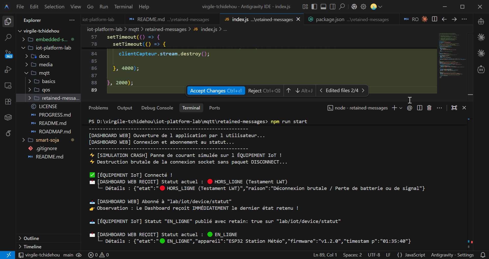

# 03 — MQTT Retained Messages & Last Will and Testament (LWT)

Troisième atelier pratique sur le protocole **MQTT** axé sur la gestion de l'état des équipements et la détection automatique de panne grâce aux **Retained Messages** et au **Last Will & Testament (LWT)**.

---

## 🎯 Quel est l'objectif ?

- Découvrir et utiliser les **Retained Messages** (`retain: true`)
- Configurer un **Last Will & Testament (LWT)** lors de la connexion MQTT
- Permettre à une application ou un dashboard d'obtenir immédiatement le dernier état d'un appareil connecté dès l'ouverture
- Gérer la détection automatique de déconnexion brutale d'un équipement (perte d'alimentation, coupure réseau)

---

## 💡 Pourquoi ces concepts sont-ils fondamentaux en IoT ?

### 1. Le problème des abonnés tardifs (Retained Messages)
Sans message retenu (`retain: false`), un dashboard web ou une application mobile s'abonnant à un sujet MQTT ne verra rien sur son écran tant que l'équipement n'aura pas envoyé sa *prochaine* mesure. Si l'équipement n'émet que toutes me 10 minutes, l'utilisateur fait face à un écran vide !

Avec **`retain: true`**, le Broker MQTT conserve en mémoire le **dernier message publié**. Dès qu'un utilisateur ouvre l'application et s'abonne au topic, le Broker lui transmet immédiatement ce dernier message !

### 2. Le problème des pannes invisibles (Last Will & Testament)
Si un capteur de température ou une pompe d'irrigation subit une coupure de courant ou une perte de réseau, l'équipement meurt brutalement sans pouvoir envoyer un message `"OFFLINE"`.

Le **Last Will & Testament (LWT)** résout cela : lors de la connexion initiale, l'équipement confie au Broker une "dernière volonté". Si le Broker constate que la connexion socket est rompue de manière inattendue, **le Broker lui-même** publie ce testament sur le sujet spécifié !

---

## ⚙️ Architecture de l'atelier

```text
1. Équipement IoT ── Connexion + LWT ("HORS_LIGNE") ──► Broker MQTT
2. Équipement IoT ── Publish ("EN_LIGNE", retain: true) ──► Broker MQTT (Stocke le statut)
                                                                 │
3. Dashboard Web ── Subscribe ("lab/iot/device/statut") ─────────┤
                                                                 ▼
                                                        Reçoit immédiatement
                                                         "EN_LIGNE" (Retained)

4. Équipement IoT ── (Coupure de courant / Crash) ── X ── Broker MQTT
                                                                 │
                                                        Déclenche le LWT
                                                                 ▼
                                                        Publie "HORS_LIGNE"
                                                        au Dashboard Web !
```

---

## 🔁 Comment exécuter cet atelier ?

1. Installez les dépendances :
   ```bash
   npm install
   ```

2. Lancez la démonstration :
   ```bash
   npm start
   ```

---

## 📊 Comportement attendu dans la console

```text
=== 📡 Lab 03 — MQTT Retained Messages & Last Will (LWT) ===

[ÉQUIPEMENT IoT] Connexion au Broker avec un Testament (LWT)...
✅ [ÉQUIPEMENT IoT] Connecté !
📤 [ÉQUIPEMENT IoT] Statut "EN_LIGNE" publié avec retain: true sur "lab/iot/device/statut"

---------------------------------------------------------
[DASHBOARD WEB] Ouverture de l application par l utilisateur...
[DASHBOARD WEB] Connexion et abonnement au statut...
📥 [DASHBOARD WEB] Abonné à "lab/iot/device/statut"
👉 Observation : Le Dashboard reçoit IMMÉDIATEMENT le dernier état retenu !

📩 [DASHBOARD WEB REÇOIT] Statut actuel : 🟢 EN_LIGNE
   └─ Détails : {"etat":"🟢 EN_LIGNE","appareil":"ESP32 Station Météo","firmware":"v1.2.0"}

---------------------------------------------------------
⚡ [SIMULATION CRASH] Panne de courant simulée sur l ÉQUIPEMENT IoT !
⚡ Destruction brutale de la connexion socket sans paquet DISCONNECT...

📩 [DASHBOARD WEB REÇOIT] Statut actuel : 🔴 HORS_LIGNE (Testament LWT)
   └─ Détails : {"etat":"🔴 HORS_LIGNE (Testament LWT)","raison":"Déconnexion brutale / Perte de batterie ou de signal"}
```

<div align="center">



*Figure 1 : Capture de l'exécution montrant la réception immédiate du message retenu et la réception automatique du testament LWT lors du crash.*

</div>
