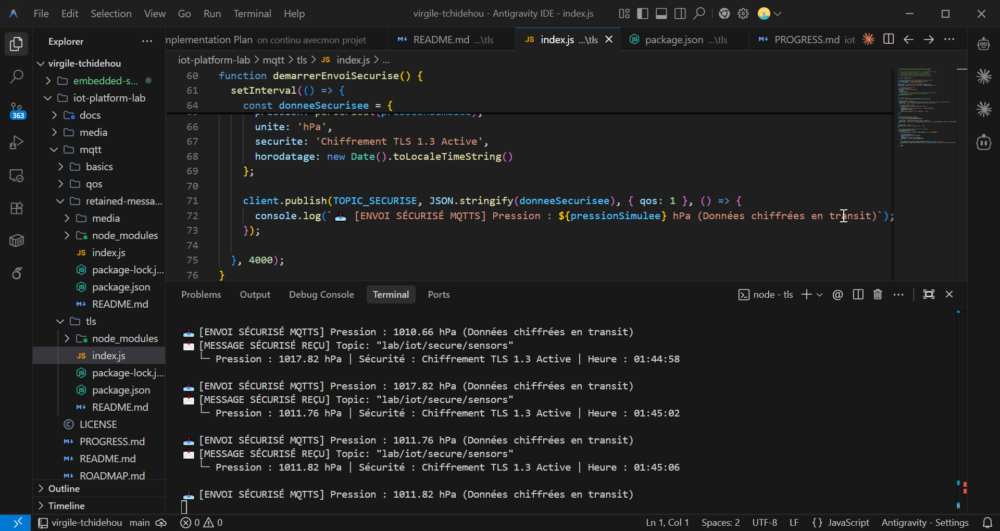

# 04 — MQTT TLS Encryption (MQTTS Sécurisé)

Quatrième atelier pratique sur le protocole **MQTT** axé sur la sécurisation des communications IoT via le chiffrement **TLS/SSL (Transport Layer Security)**.

---

## 🎯 Quel est l'objectif ?

- Comprendre les risques des échanges MQTT en clair (Port 1883)
- Configurer une connexion chiffrée **MQTTS** (`mqtts://`, Port 8883)
- Comprendre la phase de **TLS Handshake** et la validation des certificats CA
- Garantir la confidentialité et l'intégrité des données transmises entre le microcontrôleur (ESP32) et le Cloud

---

## 💡 Pourquoi la sécurité TLS est-elle indispensable en IoT ?

Dans les réseaux sans fil publics ou industriels (Wi-Fi, 4G, 5G, Internet), tout paquet envoyé sur le port standard MQTT (1883) circule **en texte clair**.

Un attaquant utilisant un sniffer de paquets (ex: Wireshark) sur le même réseau peut facilement :
1. **Intercepter des données confidentielles** (mesures de capteurs, coordonnées GPS, identifiants d'accès).
2. **Injecter de fausses commandes** pour manipuler des actionneurs (ouvrir une vanne, éteindre un moteur).

```text
 ❌ MQTT Non Sécurisé (Port 1883) :
 Capteur ESP32 ────────► [ Message en clair ] ────────► Broker MQTT (Attaques Wireshark possibles)

 ✅ MQTTS Sécurisé avec TLS (Port 8883) :
 Capteur ESP32 ══ Chiffrement TLS (AES-256) ══► Broker MQTT (Données illisibles en transit)
```

---

## ⚙️ Les ports MQTT standards

| Protocole | URL Scheme | Port par défaut | Sécurité |
|---|---|---|---|
| MQTT | `mqtt://` | 1883 | 🔴 Non chiffré (Texte clair) |
| MQTTS | `mqtts://` | 8883 / 8884 | 🟢 Chiffré par TLS/SSL |
| MQTT WebSockets | `ws://` | 8080 / 80 | 🔴 Non chiffré |
| MQTTS WebSockets | `wss://` | 8084 / 443 | 🟢 Chiffré par WSS / TLS |

---

## 🔁 Comment exécuter cet atelier ?

1. Installez les dépendances :
   ```bash
   npm install
   ```

2. Lancez la connexion sécurisée :
   ```bash
   npm start
   ```

---

## 📊 Comportement attendu dans la console

```text
=== 🔒 Lab 04 — MQTT TLS Encryption (MQTTS) ===
Connexion sécurisée TLS au Broker : mqtts://test.mosquitto.org:8883...

✅ [TLS HANDSHAKE RÉUSSI] Connexion chiffrée établie avec succès sur le port 8883 !
🔒 Tous les messages échangés sont chiffrés avec TLS.

📥 Abonné au Topic Sécurisé : "lab/iot/secure/sensors"

📤 [ENVOI SÉCURISÉ MQTTS] Pression : 1014.12 hPa (Données chiffrées en transit)
📩 [MESSAGE SÉCURISÉ REÇU] Topic: "lab/iot/secure/sensors"
   └─ Pression : 1014.12 hPa | Sécurité : Chiffrement TLS 1.3 Active | Heure : 01:42:10
```

<div align="center">



*Figure 1 : Capture de la connexion sécurisée MQTTS sur le port 8883 avec TLS Handshake et publication chiffrée.*

</div>
